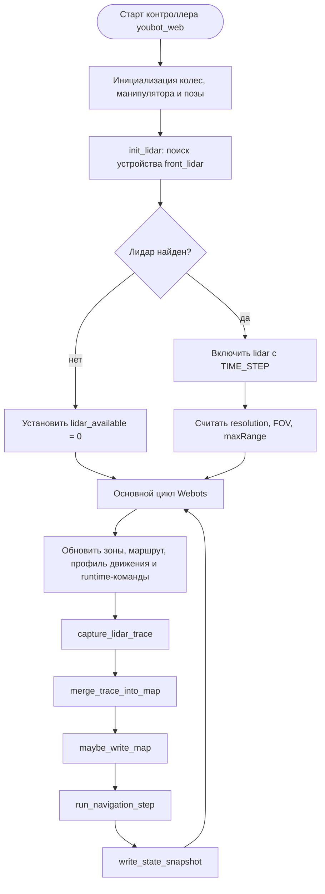
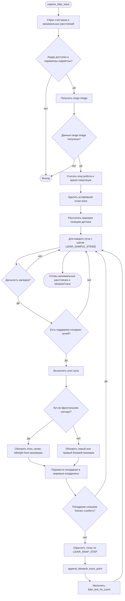
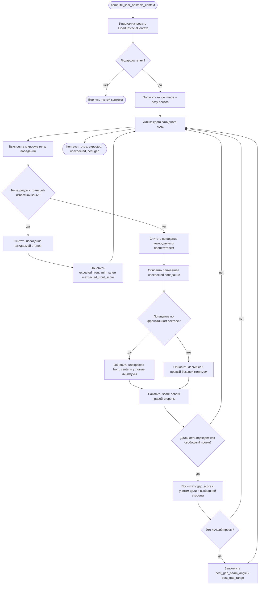
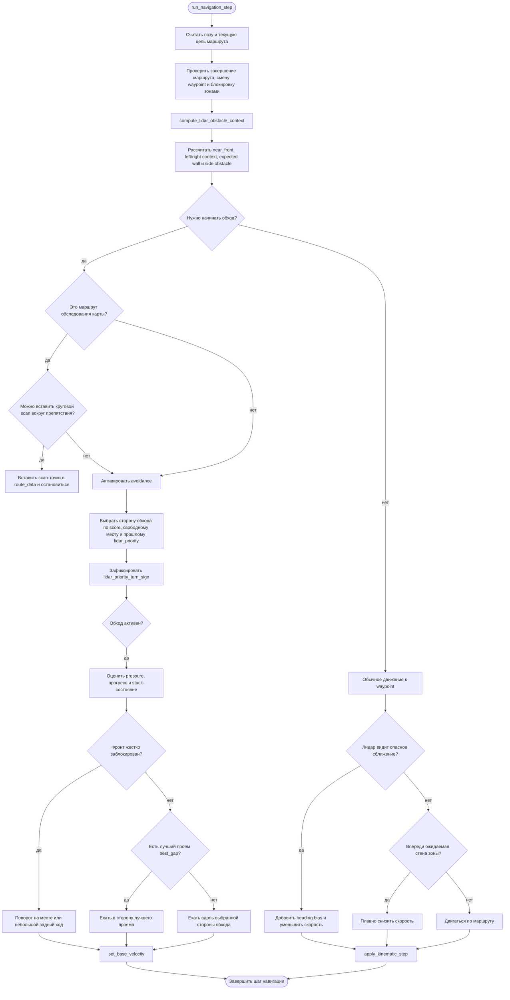
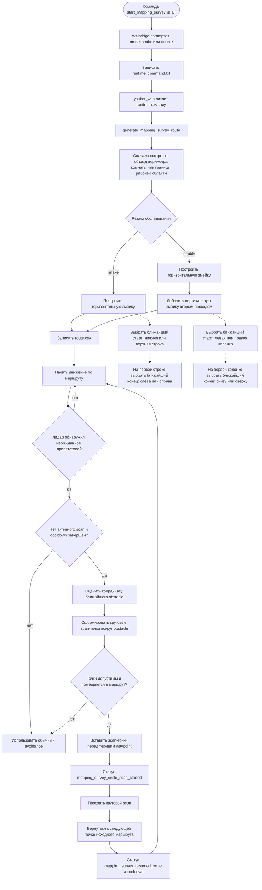
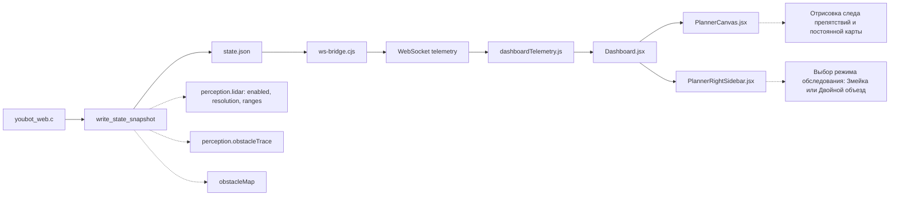

# Блок-схемы алгоритмов модуля Lidar

Документ описывает изменения, связанные с лидаром: получение данных из Webots, построение следа препятствий, классификацию ожидаемых стен и неожиданных препятствий, обход препятствий, режим обследования карты и передачу телеметрии в интерфейс.

## 1. Общий цикл работы lidar-модуля

Описание: схема показывает общий жизненный цикл lidar-модуля внутри контроллера Webots. После запуска контроллер ищет устройство `front_lidar`, включает его и сохраняет основные параметры датчика: разрешение, угол обзора и максимальную дальность. Далее в каждом шаге симуляции выполняется единый цикл: обновляются входные данные, считываются лучи лидара, строится карта препятствий, рассчитывается движение робота и записывается состояние для интерфейса.

Входные данные: устройство `front_lidar` из мира Webots, текущий маршрут, зоны ограничений, профиль движения и runtime-команды.

Результат: лидар становится частью основного цикла управления роботом; на каждом шаге симуляции данные датчика влияют на навигацию и попадают в телеметрию.

## 2. Обработка лучей лидара и построение следа препятствий

Описание: схема раскрывает алгоритм первичной обработки данных лидара. Контроллер получает массив расстояний от Webots, проверяет корректность каждого луча, отбрасывает слишком близкие, слишком дальние и нестабильные измерения. Для надежности попадание проверяется соседними лучами: если соседние значения резко отличаются, измерение считается шумом.

После фильтрации луч переводится из локальной системы координат робота в мировую. Алгоритм отдельно запоминает минимальные расстояния спереди, по центру, в передних углах, слева и справа. Также точки попаданий округляются по сетке и добавляются в `obstacleTrace`, чтобы интерфейс мог показать след обнаруженных препятствий.

Входные данные: массив `range image`, поза робота, параметры лидара.

Результат: сформированы минимальные расстояния по секторам и обновлен временный след препятствий.

## 3. Классификация препятствий: ожидаемая стена или новое препятствие

Описание: эта схема показывает, как lidar-модуль отличает ожидаемые объекты от новых препятствий. Если точка попадания находится рядом с границей известной зоны, она считается ожидаемой стеной или ограничением. Такие точки не запускают аварийный обход, а используются для плавного замедления рядом с границами.

Если попадание не совпадает с известной зоной, оно считается неожиданным препятствием. Для таких точек алгоритм считает минимальные расстояния по секторам, накапливает оценки опасности слева и справа, ищет ближайшее препятствие и одновременно выбирает лучший свободный проем (`best gap`) для объезда.

Входные данные: лучи лидара, текущая поза робота, список зон, направление на целевую точку.

Результат: структура `LidarObstacleContext`, в которой собрана информация для принятия решения: где препятствие, насколько оно опасно, какая сторона свободнее и есть ли подходящий проем для движения.

## 4. Навигация с приоритетом lidar и обходом препятствий

Описание: схема описывает, как данные лидара влияют на движение робота. Сначала робот проверяет маршрут и текущую цель, затем строит `LidarObstacleContext`. Если препятствие находится достаточно близко, включается режим обхода. Сторона обхода выбирается по свободному пространству, накопленным оценкам слева и справа, а также по предыдущему направлению `lidar_priority_turn_sign`, чтобы робот не дергался между сторонами.

Если впереди жесткая блокировка, робот останавливается, поворачивает на месте или немного отъезжает назад. Если найден свободный проем, робот старается направиться в него. Если проема нет, он движется вдоль выбранной стороны препятствия. Когда препятствие исчезает из контекста, робот возвращается к обычному движению по маршруту.

Если препятствие еще не требует полного обхода, lidar все равно влияет на движение: добавляется небольшой поворотный bias и уменьшается скорость. Это позволяет заранее обходить опасные сближения и мягче проходить рядом со стенами.

Входные данные: текущая поза, waypoint маршрута, `LidarObstacleContext`, ограничения скорости.

Результат: рассчитаны линейная и угловая скорости робота с учетом препятствий.

## 5. Режим обследования карты и вставка scan-маршрута

Описание: схема относится к режиму автоматического обследования карты. Пользователь запускает обследование из интерфейса и выбирает режим: обычная змейка (`snake`) или двойной объезд (`double`). `ws-bridge` проверяет режим и передает команду в Webots-контроллер через runtime-файл.

Перед любым режимом контроллер сначала строит объезд периметра: если робот находится внутри комнаты-зоны, используется контур комнаты, иначе строится контур рабочей сетки. Только после этого начинается обследование внутренней области.

В режиме `snake` строится один горизонтальный проход змейкой. В режиме `double` сначала строится такая же горизонтальная змейка, а затем добавляется второй проход вертикальной змейкой. Для обоих проходов выбирается ближайший вход в змейку: горизонтальный проход может начаться с нижней или верхней строки, вертикальный — с левой или правой колонки. На первой линии также выбирается ближайший конец, чтобы робот не делал лишний переход перед началом покрытия.

Если во время обследования лидар обнаруживает неожиданное препятствие, алгоритм может временно вставить в маршрут дополнительные точки: робот делает круговой scan вокруг объекта, чтобы лучше собрать его форму. После завершения scan-точек робот возвращается к следующей точке исходного маршрута обследования и продолжает текущий проход. После этого включается cooldown, чтобы один и тот же объект не запускал бесконечные повторные scan-маршруты.

Входные данные: команда `start_mapping_survey`, режим `snake` или `double`, текущие данные лидара.

Результат: построен маршрут обследования карты без режима квадратов; при обнаружении препятствий маршрут динамически дополняется точками для кругового сканирования и затем продолжается с исходной траектории.

## 6. Передача результата в интерфейс

Описание: схема показывает путь данных от Webots-контроллера до пользовательского интерфейса. После каждого шага симуляции `youbot_web.c` записывает снимок состояния в `state.json`. В него входят данные `perception.lidar`, временный след препятствий `obstacleTrace` и постоянная карта препятствий `obstacleMap`.

`ws-bridge.cjs` читает это состояние и отправляет его по WebSocket во frontend. Далее данные нормализуются в `dashboardTelemetry.js`, попадают в `Dashboard.jsx` и используются компонентами интерфейса. `PlannerCanvas.jsx` рисует след препятствий и постоянную карту, а `PlannerRightSidebar.jsx` дает пользователю управление режимом обследования без параметров квадратов.

Входные данные: файл состояния `state.json`, WebSocket-соединение, данные телеметрии.

Результат: пользователь видит работу лидара на карте и может запускать обследование с нужными параметрами.

## Что покрывает схема

- `webots/worlds/youbot_only.wbt`: добавлен `front_lidar` на робота.
- `webots/controllers/youbot_web/youbot_web.c`: инициализация лидара, фильтрация лучей, trace препятствий, persistent map, классификация expected/unexpected, best-gap обход, lidar-priority движение, построение `snake/double` маршрутов обследования и dynamic scan для mapping survey.
- `ws-bridge.cjs`: передача команды `start_mapping_survey` с режимом `snake/double`.
- `src/pages/Dashboard.jsx`: состояние режима обследования и отправка выбранного режима в Webots.
- `src/components/dashboard/PlannerRightSidebar.jsx`: выбор режима `Змейка` или `Двойной объезд`.
- `src/components/dashboard/PlannerCanvas.jsx`: визуализация obstacle trace и постоянной карты.
