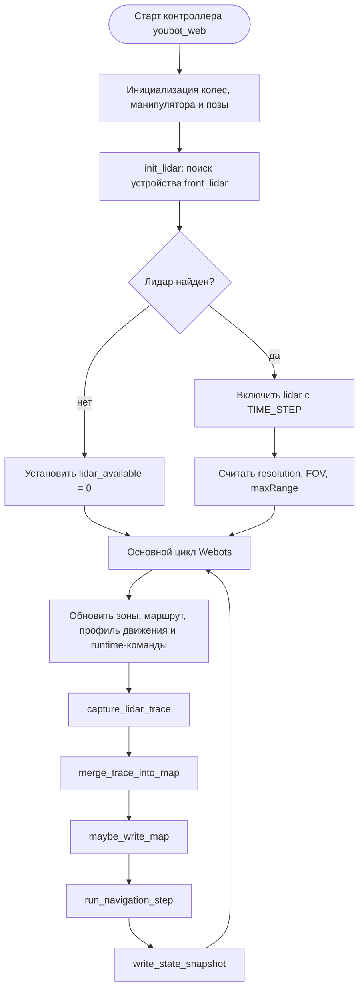
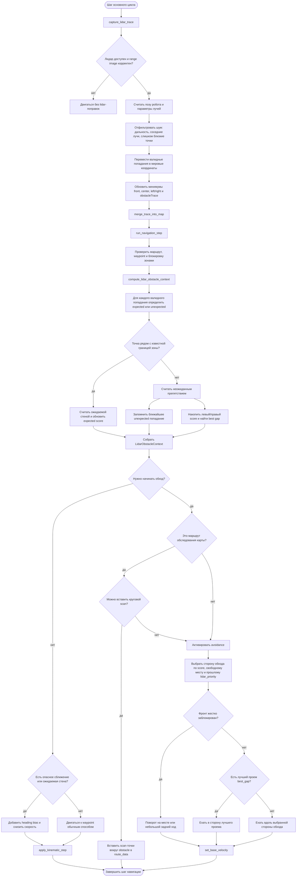
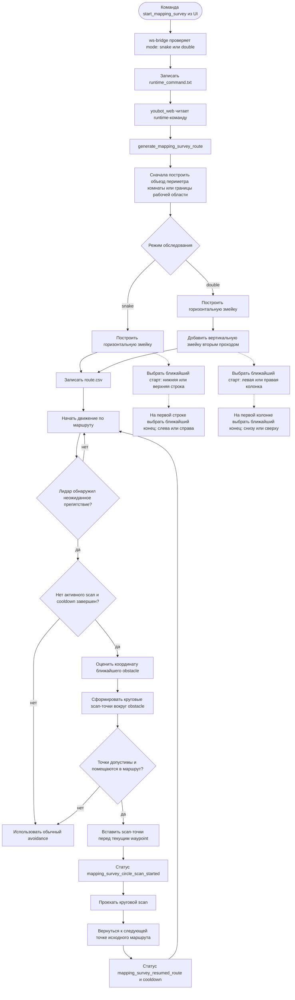
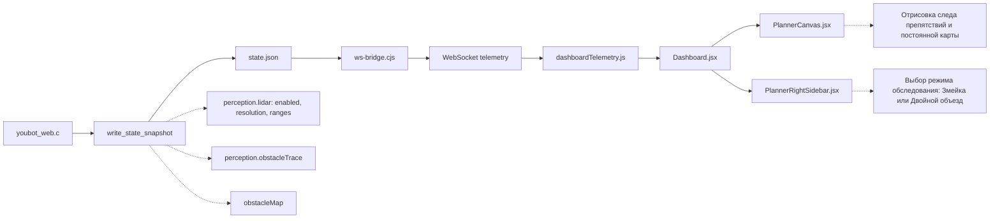

# Блок-схемы алгоритмов модуля Lidar

Документ описывает изменения, связанные с лидаром: получение данных из Webots, построение следа препятствий, классификацию ожидаемых стен и неожиданных препятствий, обход препятствий, режим обследования карты и передачу телеметрии в интерфейс.

## 1. Общий цикл работы lidar-модуля

```mermaid
flowchart TD
    A([Старт контроллера youbot_web]) --> B[Инициализация колес, манипулятора и позы]
    B --> C[init_lidar: поиск устройства front_lidar]
    C --> D{Лидар найден?}
    D -- нет --> E[Установить lidar_available = 0]
    D -- да --> F[Включить lidar с TIME_STEP]
    F --> G[Считать resolution, FOV, maxRange]
    E --> H[Основной цикл Webots]
    G --> H

    H --> I[Обновить зоны, маршрут, профиль движения и runtime-команды]
    I --> J[capture_lidar_trace]
    J --> K[merge_trace_into_map]
    K --> L[maybe_write_map]
    L --> M[run_navigation_step]
    M --> N[write_state_snapshot]
    N --> H
```

Описание: схема показывает общий жизненный цикл lidar-модуля внутри контроллера Webots. После запуска контроллер ищет устройство `front_lidar`, включает его и сохраняет основные параметры датчика: разрешение, угол обзора и максимальную дальность. Далее в каждом шаге симуляции выполняется единый цикл: обновляются входные данные, считываются лучи лидара, строится карта препятствий, рассчитывается движение робота и записывается состояние для интерфейса.

Входные данные: устройство `front_lidar` из мира Webots, текущий маршрут, зоны ограничений, профиль движения и runtime-команды.

Результат: лидар становится частью основного цикла управления роботом; на каждом шаге симуляции данные датчика влияют на навигацию и попадают в телеметрию.

## 2. Обработка лидара, классификация препятствий и движение

```mermaid
flowchart TD
    A([Шаг основного цикла]) --> B[capture_lidar_trace]
    B --> C{Лидар доступен и range image корректен?}
    C -- нет --> Z[Двигаться без lidar-поправок]
    C -- да --> D[Считать позу робота и параметры лучей]
    D --> E[Отфильтровать шум: дальность, соседние лучи, слишком близкие точки]
    E --> F[Перевести валидные попадания в мировые координаты]
    F --> G[Обновить минимумы front, center, left/right и obstacleTrace]
    G --> H[merge_trace_into_map]

    H --> I[run_navigation_step]
    I --> J[Проверить маршрут, waypoint и блокировку зонами]
    J --> K[compute_lidar_obstacle_context]
    K --> L[Для каждого валидного попадания определить expected или unexpected]
    L --> M{Точка рядом с известной границей зоны?}
    M -- да --> N[Считать ожидаемой стеной и обновить expected score]
    M -- нет --> O[Считать неожиданным препятствием]
    O --> P[Запомнить ближайшее unexpected попадание]
    O --> Q[Накопить левый/правый score и найти best gap]
    N --> R[Собрать LidarObstacleContext]
    P --> R
    Q --> R

    R --> S{Нужно начинать обход?}
    S -- нет --> T{Есть опасное сближение или ожидаемая стена?}
    T -- да --> U[Добавить heading bias и снизить скорость]
    T -- нет --> V[Двигаться к waypoint обычным способом]
    U --> W[apply_kinematic_step]
    V --> W

    S -- да --> X{Это маршрут обследования карты?}
    X -- да --> Y{Можно вставить круговой scan?}
    Y -- да --> AA[Вставить scan-точки вокруг obstacle в route_data]
    Y -- нет --> AB[Активировать avoidance]
    X -- нет --> AB
    AB --> AC[Выбрать сторону обхода по score, свободному месту и прошлому lidar_priority]
    AC --> AD{Фронт жестко заблокирован?}
    AD -- да --> AE[Поворот на месте или небольшой задний ход]
    AD -- нет --> AF{Есть лучший проем best_gap?}
    AF -- да --> AG[Ехать в сторону лучшего проема]
    AF -- нет --> AH[Ехать вдоль выбранной стороны обхода]
    AE --> AI[set_base_velocity]
    AG --> AI
    AH --> AI
    AA --> AJ([Завершить шаг навигации])
    W --> AJ
    AI --> AJ
```

Описание: этот раздел объединяет три близких этапа работы лидара: первичную обработку лучей, классификацию препятствий и влияние результата на движение. Контроллер получает `range image`, отбрасывает шумные измерения, проверяет поддержку соседних лучей, переводит валидные попадания в мировые координаты и обновляет минимальные расстояния по секторам. Эти же попадания попадают во временный след `obstacleTrace` и затем в постоянную карту препятствий.

После этого `run_navigation_step` строит `LidarObstacleContext`: точки рядом с известными границами зон считаются ожидаемыми стенами, а остальные — неожиданными препятствиями. Для неожиданных препятствий запоминается ближайшее попадание, считаются оценки опасности слева и справа, а также выбирается лучший свободный проем (`best gap`), если он есть.

Дальше этот контекст напрямую влияет на движение. Если полного обхода не требуется, робот продолжает ехать к waypoint, но может заранее снизить скорость и добавить небольшой поворотный bias. Если препятствие находится слишком близко, включается обход: выбирается сторона по свободному месту, накопленным оценкам и прошлому направлению `lidar_priority_turn_sign`. При жесткой блокировке робот поворачивает на месте или слегка отъезжает назад; при найденном `best gap` едет в сторону проема; иначе движется вдоль выбранной стороны препятствия.

Для маршрута обследования карты есть дополнительная ветка: если найдено неожиданное препятствие и нет активного cooldown, в маршрут могут быть временно вставлены точки кругового scan вокруг объекта. После scan робот возвращается к исходному маршруту обследования.

Входные данные: массив `range image`, поза робота, текущий waypoint, зоны ограничений, параметры лидара и ограничения скорости.

Результат: обновлены след и карта препятствий, сформирован `LidarObstacleContext`, рассчитано движение робота с учетом стен, новых препятствий и возможного обхода.

## 3. Режим обследования карты и вставка scan-маршрута

```mermaid
flowchart TD
    A([Команда start_mapping_survey из UI]) --> B[ws-bridge проверяет mode: snake или double]
    B --> C[Записать runtime_command.txt]
    C --> D[youbot_web читает runtime-команду]
    D --> E[generate_mapping_survey_route]
    E --> F[Сначала построить объезд периметра комнаты или границы рабочей области]
    F --> G{Режим обследования}
    G -- snake --> H[Построить горизонтальную змейку]
    G -- double --> I[Построить горизонтальную змейку]
    I --> J[Добавить вертикальную змейку вторым проходом]
    H --> K[Записать route.csv]
    J --> K
    K --> L[Начать движение по маршруту]

    H -.-> H1[Выбрать ближайший старт: нижняя или верхняя строка]
    H1 -.-> H2[На первой строке выбрать ближайший конец: слева или справа]
    J -.-> J1[Выбрать ближайший старт: левая или правая колонка]
    J1 -.-> J2[На первой колонке выбрать ближайший конец: снизу или сверху]

    L --> M{Лидар обнаружил неожиданное препятствие?}
    M -- нет --> L
    M -- да --> N{Нет активного scan и cooldown завершен?}
    N -- нет --> O[Использовать обычный avoidance]
    N -- да --> P[Оценить координату ближайшего obstacle]
    P --> Q[Сформировать круговые scan-точки вокруг obstacle]
    Q --> R{Точки допустимы и помещаются в маршрут?}
    R -- нет --> O
    R -- да --> S[Вставить scan-точки перед текущим waypoint]
    S --> T[Статус mapping_survey_circle_scan_started]
    T --> U[Проехать круговой scan]
    U --> V[Вернуться к следующей точке исходного маршрута]
    V --> W[Статус mapping_survey_resumed_route и cooldown]
    W --> L
```

Описание: схема относится к режиму автоматического обследования карты. Пользователь запускает обследование из интерфейса и выбирает режим: обычная змейка (`snake`) или двойной объезд (`double`). `ws-bridge` проверяет режим и передает команду в Webots-контроллер через runtime-файл.

Перед любым режимом контроллер сначала строит объезд периметра: если робот находится внутри комнаты-зоны, используется контур комнаты, иначе строится контур рабочей сетки. Только после этого начинается обследование внутренней области.

В режиме `snake` строится один горизонтальный проход змейкой. В режиме `double` сначала строится такая же горизонтальная змейка, а затем добавляется второй проход вертикальной змейкой. Для обоих проходов выбирается ближайший вход в змейку: горизонтальный проход может начаться с нижней или верхней строки, вертикальный — с левой или правой колонки. На первой линии также выбирается ближайший конец, чтобы робот не делал лишний переход перед началом покрытия.

Если во время обследования лидар обнаруживает неожиданное препятствие, алгоритм может временно вставить в маршрут дополнительные точки: робот делает круговой scan вокруг объекта, чтобы лучше собрать его форму. После завершения scan-точек робот возвращается к следующей точке исходного маршрута обследования и продолжает текущий проход. После этого включается cooldown, чтобы один и тот же объект не запускал бесконечные повторные scan-маршруты.

Входные данные: команда `start_mapping_survey`, режим `snake` или `double`, текущие данные лидара.

Результат: построен маршрут обследования карты без режима квадратов; при обнаружении препятствий маршрут динамически дополняется точками для кругового сканирования и затем продолжается с исходной траектории.

## 4. Передача результата в интерфейс

```mermaid
flowchart LR
    A[youbot_web.c] --> B[write_state_snapshot]
    B --> C[state.json]
    C --> D[ws-bridge.cjs]
    D --> E[WebSocket telemetry]
    E --> F[dashboardTelemetry.js]
    F --> G[Dashboard.jsx]
    G --> H[PlannerCanvas.jsx]
    G --> I[PlannerRightSidebar.jsx]

    B -.-> J[perception.lidar: enabled, resolution, ranges]
    B -.-> K[perception.obstacleTrace]
    B -.-> L[obstacleMap]
    H -.-> M[Отрисовка следа препятствий и постоянной карты]
    I -.-> N[Выбор режима обследования: Змейка или Двойной объезд]
```

Описание: схема показывает путь данных от Webots-контроллера до пользовательского интерфейса. После каждого шага симуляции `youbot_web.c` записывает снимок состояния в `state.json`. В него входят данные `perception.lidar`, временный след препятствий `obstacleTrace` и постоянная карта препятствий `obstacleMap`.

`ws-bridge.cjs` читает это состояние и отправляет его по WebSocket во frontend. Далее данные нормализуются в `dashboardTelemetry.js`, попадают в `Dashboard.jsx` и используются компонентами интерфейса. `PlannerCanvas.jsx` рисует след препятствий и постоянную карту, а `PlannerRightSidebar.jsx` дает пользователю управление режимом обследования без параметров квадратов.

Входные данные: файл состояния `state.json`, WebSocket-соединение, данные телеметрии.

Результат: пользователь видит работу лидара на карте и может запускать обследование с нужными параметрами.

## Что покрывает схема

- `webots/worlds/youbot_only.wbt`: добавлен `front_lidar` на робота.
- `webots/controllers/youbot_web/youbot_web.c`: инициализация лидара, фильтрация лучей, trace препятствий, persistent map, классификация expected/unexpected, best-gap обход, lidar-priority движение, построение `snake/double` маршрутов обследования и dynamic scan для mapping survey.
- `ws-bridge.cjs`: передача команды `start_mapping_survey` с режимом `snake/double`.
- `src/pages/Dashboard.jsx`: состояние режима обследования и отправка выбранного режима в Webots.
- `src/components/dashboard/PlannerRightSidebar.jsx`: выбор режима `Змейка` или `Двойной объезд`.
- `src/components/dashboard/PlannerCanvas.jsx`: визуализация obstacle trace и постоянной карты.
