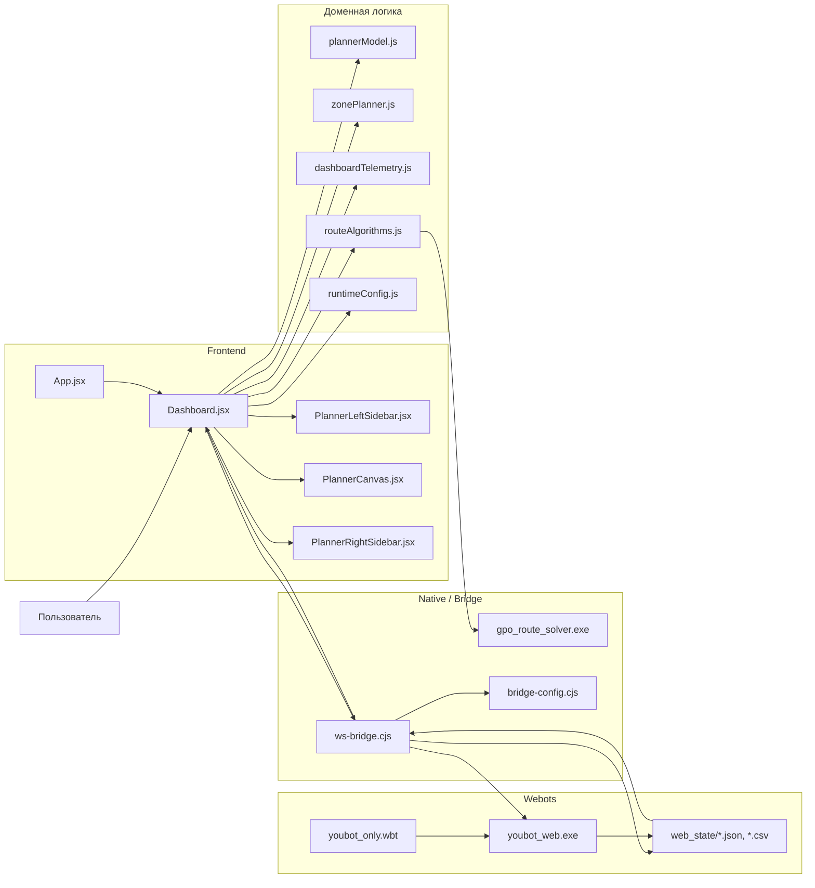
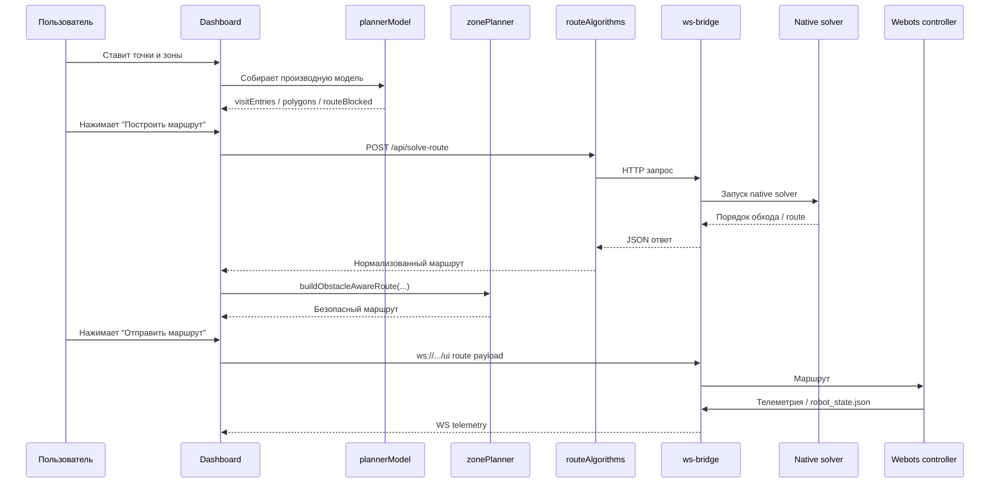

# Схема проекта GPO

Этот файл нужен как короткая техническая карта проекта: какие модули у нас
главные, как течет маршрут от UI до робота и какие файлы реально важны в
текущем рабочем сценарии.

## Основной поток

## Что за что отвечает

### UI-слой

- [App.jsx](./src/App.jsx)
  Точка входа приложения.

- [Dashboard.jsx](./src/pages/Dashboard.jsx)
  Главный экран и оркестрация сценария.

- [PlannerLeftSidebar.jsx](./src/components/dashboard/PlannerLeftSidebar.jsx)
  Управление режимами точки, выбором задачи, алгоритма и запуском построения.

- [PlannerCanvas.jsx](./src/components/dashboard/PlannerCanvas.jsx)
  Отрисовка карты, зон, маршрута и робота.

- [PlannerRightSidebar.jsx](./src/components/dashboard/PlannerRightSidebar.jsx)
  Управление зонами, списком точек и отображение телеметрии.

### Доменная логика

- [plannerModel.js](./src/lib/plannerModel.js)
  Единая производная модель интерфейса: `visitEntries`, `zoneEntries`,
  `plannedVisitEntries`, `polygons`, `routeBlocked`, `routeLength`.

- [zonePlanner.js](./src/lib/zonePlanner.js)
  Геометрия карты, полигоны, проекция точек, безопасные отступы и обход
  препятствий.

- [routeAlgorithms.js](./src/lib/routeAlgorithms.js)
  Клиент native solver API.

- [dashboardTelemetry.js](./src/lib/dashboardTelemetry.js)
  Нормализация телеметрии и утилиты для WebSocket-сообщений.

- [runtimeConfig.js](./src/lib/runtimeConfig.js)
  Runtime-конфиг фронтенда из `VITE_*`.

### Native / bridge

- [ws-bridge.cjs](./ws-bridge.cjs)
  HTTP API для solver, WebSocket-мост маршрута и телеметрии, запись route/state
  артефактов.

- [bridge-config.cjs](./bridge-config.cjs)
  Общий runtime-конфиг bridge-слоя.

- [gpo_route_solver.cpp](./native/apps/gpo_route_solver.cpp)
  Точка входа native solver.

- [coordinate-contract.json](./shared/coordinate-contract.json)
  Источник истины для формата координат и телеметрии.

### Webots

- [youbot_only.wbt](./webots/worlds/youbot_only.wbt)
  Рабочий мир `Webots`.

- [youbot_web.c](./webots/controllers/youbot_web/youbot_web.c)
  Контроллер `youBot`, который читает маршрут и пишет состояние.

- [web_state](./web_state)
  Runtime-файлы обмена между bridge и controller.

## Текущий рабочий сценарий

## Точки качества, которые уже закрыты

- Единый координатный контракт зафиксирован.
- Bridge больше не блокирует event loop синхронным solver/fs.
- `Dashboard` разрезан на отдельные UI-блоки и общую модель.
- Runtime host/ports вынесены в `env`.
- Мертвые страницы и старые компоненты убраны.
- Добавлены unit-тесты и smoke-test bridge.

## Что остается важным ограничением

- Для стабильной dev-среды лучше обновить Node до `22.12+`.
- Полноценные e2e-тесты с реальным `Webots` пока не автоматизированы.
- Контроллер робота и физика `Webots` остаются отдельным уровнем риска по
  сравнению с чистым frontend/runtime.
